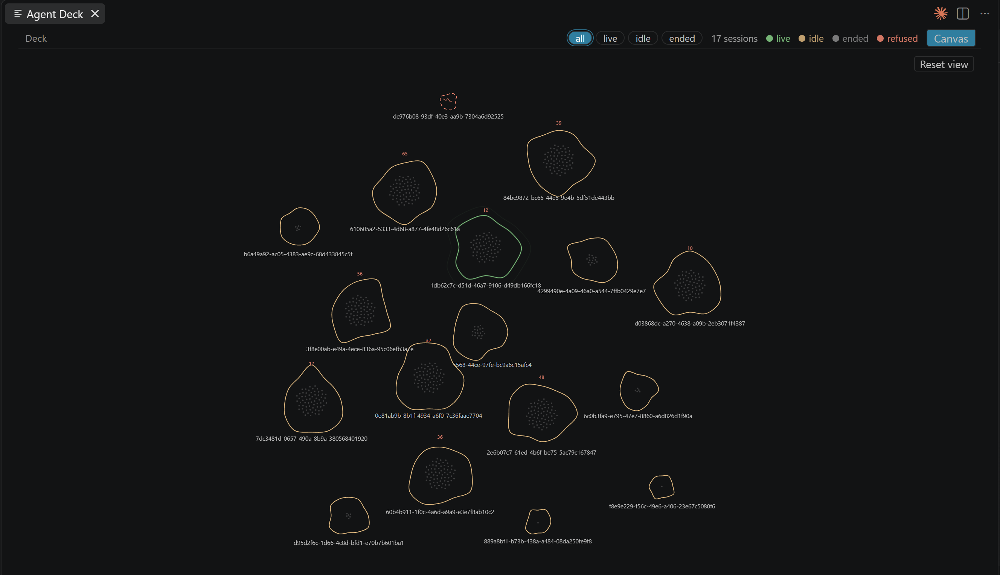
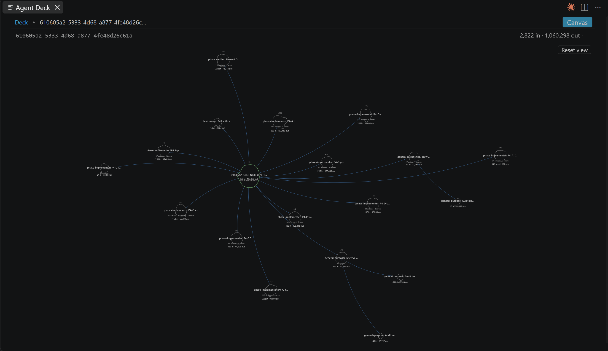
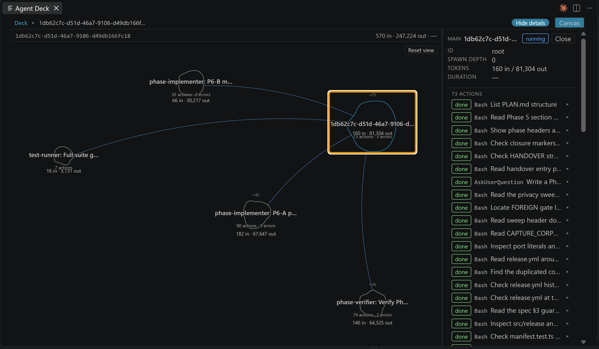

# Agent Deck

[](https://marketplace.visualstudio.com/items?itemName=nvitlam.agent-deck)

A **read-only** VS Code extension that renders live agent session topology — subagent trees,
in-flight tool calls, token and cost totals — by observing what the agent leaves behind. It watches
**Claude Code** and **OpenCode**, side by side in one deck, and it never wraps, proxies, launches, or
configures either of them.

> **Claude Code compatibility** — anchor `2.1.246`, accepts `2.0.x` to `2.2.x`, refuses on
> structural change, not on patch number. See [Claude Code version window](#claude-code-version-window).

<!-- engine:opencode -->

> **OpenCode compatibility** — anchor `1.18.22`, accepts `1.17.x` to `1.19.x`, same rule: the patch
> number is not compared, and what refuses is the schema. See
> [Also observes OpenCode](#also-observes-opencode).

<!-- /engine:opencode -->

> This badge is text, not a remote image: a project whose selling point is zero egress should not
> make its own README phone home to a badge service to render.

---



## Read-only by design

Agent Deck observes. It never acts.

- It reads Claude Code's session JSONL, listens for hook events, and reads
  OpenCode's session database. That is all.
- It never wraps, proxies, launches or configures either engine.
- It never writes to `~/.claude`, to Claude Code settings, or to your session
  files. Installing the hooks is a manual paste block you control, below.
- Zero network egress. The only socket it opens is an HTTP listener bound to
  `127.0.0.1`, which is how the hooks reach it. Non-loopback requests are
  dropped. **The OpenCode side opens no socket at all.**
- No telemetry, no analytics, no CDN. Every asset the panel renders is local,
  enforced by a strict Content-Security-Policy.

**One precise qualification, because "never writes anything" would be the wrong
claim.** OpenCode's session store —
`%USERPROFILE%\.local\share\opencode\opencode.db` — is a SQLite database in WAL
mode, and opening a WAL database *read-only* writes to SQLite's own `-shm` index
sidecar (creating `-shm`/`-wal` if absent). The database itself is never
modified, and `auth.json`, `log/`, `snapshot/`, `repos/` and `tool-output/` are
never opened at all. So the rule is **no writes to any file the observed engine
treats as content**. Every reader of a WAL database touches that sidecar,
OpenCode's own process included. `SECURITY.md` §2 carries the measurements.

All state lives in memory and is discarded when the window closes.

## Features

**The deck** - every live session at a glance, from either engine, breathing
while it works. Three layouts (List, Grid, Lanes), three sort orders (Live
first, Recent, Engine), and engine chips to show one engine or both. Keyboard:
`A C O`, `1 2 3`, `L R E`.


**Agent topology** - a tidy tree. Every agent is a node, children sit under
their parent in spawn order, and each is joined to the exact call that spawned
it by a filament. That join is a primary key, not a guess. Tool calls ride each
node as chronological dots; anything the deck cannot attach to a parent goes to
a parked rail carrying the code that says why, because unplaced data is shown as
unplaced and never guessed into position. Click into any agent to re-root the
tree on it.



**Tool call inspector** - open any node for its payload, truncated with an
explicit marker and with thinking and reasoning content dropped at the parse
boundary, in both engines.



> **The three screenshots above still show the 0.1.x panel.** `v0.5.0` replaced
> the renderer; the pictures are regenerated at the release gate, and this note
> is here rather than a caption that quietly does not match.

## What it is

Claude Code leaves two kinds of exhaust behind, and Agent Deck reads both without touching either:

| Tap | Source | What it answers |
| --- | --- | --- |
| **Hooks** | a hook snippet *you* paste into your settings POSTs to a loopback HTTP listener | what is running right now |
| **JSONL** | `~/.claude/projects/<slug>/...`, read from local disk | what happened |

The split is deliberate. The hook contract is documented and stable with thin payloads; the session
files are undocumented and rich. Keeping them on separate failure paths means a Claude Code schema
change degrades the panel instead of killing it.

Everything the extension knows lives in memory in the extension host and is discarded when the
window closes. There is no database, no cache file, and nothing is ever written back to Claude Code.

<!-- engine:opencode -->

## Also observes OpenCode

Since `v0.5.0`, OpenCode sessions appear in the same deck as Claude Code ones, tagged `OC` against
`CC`, and the engine chips filter to one or show both. Nothing is configured: if OpenCode is
installed, its sessions are there; if it is not, the deck says nothing about it, because an absent
data directory is not an error and not a warning.

**What is read — one file.**

```
%USERPROFILE%\.local\share\opencode\
  opencode.db     <- the only file Agent Deck opens, read-only
  auth.json       never opened
  log/            never opened
  snapshot/       never opened
  repos/          never opened
  tool-output/    never opened
```

**Four tables are never read**, and this is by name rather than by filter: `account`,
`control_account`, `credential` and `session_share`. Those are the tables whose schema carries
access tokens, refresh tokens and share secrets. They are not queried, and they are stripped from
every test fixture in the project.

**No sockets.** The Claude Code side has exactly one — the loopback hook listener you install
yourself. The OpenCode side has **none**. It does not talk to `opencode serve`, does not open a
port, and does not resolve a hostname.

**Compatibility, same posture as the Claude Code side.** The anchor is `1.18.22` — the release whose
captured database proved the schema. Major must match, minor may be one step either way (`1.17.x` to
`1.19.x`), and **the patch component is not compared at all**, so a self-update from `1.18.22` to
`1.18.23` changes nothing. What refuses a session is the **schema**: if the six tables and the
columns actually read are not what the fixture pinned, that session renders `unsupported` rather
than a half-built tree. A database holding sessions written by several versions is normal, and the
window is applied per session, not to the file.

**Two things it does not do yet.** An OpenCode session's **context** figure reads as an em dash —
the stored token totals count only uncached input, which would understate the real prompt by roughly
an order of magnitude, so an honest absence is shown rather than a wrong number. And liveness comes
from the database's own event cursor rather than from a hook-style tap, because OpenCode has no
documented equivalent of Claude Code's hooks.

<!-- /engine:opencode -->

## Requirements

- **VS Code** `^1.134.0`
- **Node** `>=20` on your `PATH` — the hook block below is a `node -e` one-liner, so your Node is
  what runs it
- **Claude Code** on the `2.x` line, within one minor of the anchor (see below). Patch releases are
  read as they come.
- **OpenCode** — optional, and there is nothing to install or configure if you do not use it. The
  version window is in [Also observes OpenCode](#also-observes-opencode).

## Install

Install from the VS Code Marketplace - open the **Extensions** view and search for
**Agent Deck**, or run:

```console
code --install-extension nvitlam.agent-deck
```

**Then install the hook block below.** It is not optional: without it Agent Deck can still read
session transcripts, but nothing tells it what is running right now, so liveness is inferred from
file mtime alone.

## Install the hook (one manual paste)

Content and the tree render from the session files alone. The hook tap is what makes liveness
*live* — which agent is running right now, which tool call is in flight.

**Agent Deck never installs this for you and never writes either settings file.** Read-only means
read-only, including your configuration. You paste it; you own it.

Paste the `"hooks"` key below into **one** of:

- your project's own `.claude/settings.local.json` — what this repository does, and the choice that
  keeps `~/.claude` untouched entirely; or
- your user-level `~/.claude/settings.json`, if you would rather have it everywhere.

Both files are JSON objects. Merge the `"hooks"` key into whatever is already there rather than
replacing the file.

```json
{
  "hooks": {
    "SessionStart": [
      {
        "hooks": [
          {
            "type": "command",
            "command": "node -e \"let b='';process.stdin.setEncoding('utf8');process.stdin.on('error',()=>process.exit(0));process.stdin.on('data',c=>b+=c);process.stdin.on('end',()=>{const r=require('http').request({host:'127.0.0.1',port:47821,path:'/event',method:'POST',headers:{'content-type':'application/json','content-length':Buffer.byteLength(b),connection:'close'}},s=>{s.resume();s.on('end',()=>process.exit(0))});r.on('error',()=>process.exit(0));r.setTimeout(1000,()=>{r.destroy();process.exit(0)});r.end(b)});setTimeout(()=>process.exit(0),2000)\"",
            "timeout": 5
          }
        ]
      }
    ],
    "PreToolUse": [
      {
        "matcher": "*",
        "hooks": [
          {
            "type": "command",
            "command": "node -e \"let b='';process.stdin.setEncoding('utf8');process.stdin.on('error',()=>process.exit(0));process.stdin.on('data',c=>b+=c);process.stdin.on('end',()=>{const r=require('http').request({host:'127.0.0.1',port:47821,path:'/event',method:'POST',headers:{'content-type':'application/json','content-length':Buffer.byteLength(b),connection:'close'}},s=>{s.resume();s.on('end',()=>process.exit(0))});r.on('error',()=>process.exit(0));r.setTimeout(1000,()=>{r.destroy();process.exit(0)});r.end(b)});setTimeout(()=>process.exit(0),2000)\"",
            "timeout": 5
          }
        ]
      }
    ],
    "PostToolUse": [
      {
        "matcher": "*",
        "hooks": [
          {
            "type": "command",
            "command": "node -e \"let b='';process.stdin.setEncoding('utf8');process.stdin.on('error',()=>process.exit(0));process.stdin.on('data',c=>b+=c);process.stdin.on('end',()=>{const r=require('http').request({host:'127.0.0.1',port:47821,path:'/event',method:'POST',headers:{'content-type':'application/json','content-length':Buffer.byteLength(b),connection:'close'}},s=>{s.resume();s.on('end',()=>process.exit(0))});r.on('error',()=>process.exit(0));r.setTimeout(1000,()=>{r.destroy();process.exit(0)});r.end(b)});setTimeout(()=>process.exit(0),2000)\"",
            "timeout": 5
          }
        ]
      }
    ],
    "SubagentStart": [
      {
        "hooks": [
          {
            "type": "command",
            "command": "node -e \"let b='';process.stdin.setEncoding('utf8');process.stdin.on('error',()=>process.exit(0));process.stdin.on('data',c=>b+=c);process.stdin.on('end',()=>{const r=require('http').request({host:'127.0.0.1',port:47821,path:'/event',method:'POST',headers:{'content-type':'application/json','content-length':Buffer.byteLength(b),connection:'close'}},s=>{s.resume();s.on('end',()=>process.exit(0))});r.on('error',()=>process.exit(0));r.setTimeout(1000,()=>{r.destroy();process.exit(0)});r.end(b)});setTimeout(()=>process.exit(0),2000)\"",
            "timeout": 5
          }
        ]
      }
    ],
    "SubagentStop": [
      {
        "hooks": [
          {
            "type": "command",
            "command": "node -e \"let b='';process.stdin.setEncoding('utf8');process.stdin.on('error',()=>process.exit(0));process.stdin.on('data',c=>b+=c);process.stdin.on('end',()=>{const r=require('http').request({host:'127.0.0.1',port:47821,path:'/event',method:'POST',headers:{'content-type':'application/json','content-length':Buffer.byteLength(b),connection:'close'}},s=>{s.resume();s.on('end',()=>process.exit(0))});r.on('error',()=>process.exit(0));r.setTimeout(1000,()=>{r.destroy();process.exit(0)});r.end(b)});setTimeout(()=>process.exit(0),2000)\"",
            "timeout": 5
          }
        ]
      }
    ],
    "Stop": [
      {
        "hooks": [
          {
            "type": "command",
            "command": "node -e \"let b='';process.stdin.setEncoding('utf8');process.stdin.on('error',()=>process.exit(0));process.stdin.on('data',c=>b+=c);process.stdin.on('end',()=>{const r=require('http').request({host:'127.0.0.1',port:47821,path:'/event',method:'POST',headers:{'content-type':'application/json','content-length':Buffer.byteLength(b),connection:'close'}},s=>{s.resume();s.on('end',()=>process.exit(0))});r.on('error',()=>process.exit(0));r.setTimeout(1000,()=>{r.destroy();process.exit(0)});r.end(b)});setTimeout(()=>process.exit(0),2000)\"",
            "timeout": 5
          }
        ]
      }
    ]
  }
}
```

Notes on that block, each of them measured rather than assumed:

- **It is `node -e`, not `curl`, and that is not a style choice.** This command runs inside your real
  Claude Code session on every tool call. Against a closed loopback port — which is what it finds
  whenever Agent Deck is not running — `node` takes `ECONNREFUSED` and exits `0` in well under a
  fifth of a second, while `curl.exe` burns its full connect timeout (measured between 1.1 s and
  2.1 s, exiting non-zero) and stalls your session that long every single time. Simplifying it to
  `curl` costs you roughly an order of magnitude, forever, on the common path. `SECURITY.md` §5
  carries the numbers.
- **The port must match `agentDeck.port`.** The block names `47821` literally, which is that
  setting's default. If you change one, change the other: Agent Deck reports a port collision as an
  error and never silently picks a different port, because the block you pasted has no way of being
  told.
- **No Claude Code restart is needed.** Hook settings are re-read per invocation — registering a new
  event and seeing it arrive without a restart was measured on `2.1.234`.
- **The POST is unconditional.** With nothing listening it is refused and nothing happens. A quiet
  listener is not evidence that hooks stopped firing.
- **Six events are registered:** `SessionStart`, `PreToolUse`, `PostToolUse`, `SubagentStart`,
  `SubagentStop`, `Stop`. Registering fewer still works — liveness degrades rather than fails, and
  falls back to transcript modification times with a banner — but the panel gets blunter.

## Open the panel

Press <kbd>Ctrl</kbd>+<kbd>Shift</kbd>+<kbd>P</kbd> (<kbd>Cmd</kbd>+<kbd>Shift</kbd>+<kbd>P</kbd> on
macOS), type `Agent Deck`, and run **Agent Deck: Open Session Deck**.

That is the **only** entry point. Agent Deck contributes no sidebar icon, no status-bar item and no
activity-bar view - one command, one panel.

Open the folder your Claude Code session runs in first. The extension matches the open workspace
against your `~/.claude/projects` directories; if that folder has no Claude Code sessions it says so
and does nothing else.

## Usage

Three levels, and Escape walks back up out of any of them.

**Deck** - every Claude Code session on the machine, one blob each. The chip row filters by
liveness: **all**, **live**, **idle**, **ended**, **refused**. Colour is the same channel
everywhere - green live, yellow idle, grey ended, red refused - and the legend at the bottom of the
panel restates it. Drag to pan, wheel to zoom, click a session to go inside it.

**Topology** - the session interior. The main agent is the nucleus, each tool call is a dot placed
in chronological order around it, and a subagent hangs off a filament drawn from the exact tool-call
dot that spawned it. Click any node to open it in the inspector. The **Deck** breadcrumb returns to
the deck, and **Reset view** re-centres pan and zoom without changing anything else.

**Inspector** - the detail pane for whatever is selected. Per agent it lists status
(**running**, **done**, **error**), tokens as *in / out*, duration and spawn depth, with the tool
payload beneath it. **Show details** / **Hide details** collapses the payload, **Close** dismisses
the pane.

## Settings

| Setting | What it does |
| --- | --- |
| `agentDeck.port` | The loopback port the hook listener binds on `127.0.0.1`. Must match the port in the block you pasted. |
| `agentDeck.livenessThresholdMs` | How long a session may go quiet before it stops counting as live. Set it too low and one long tool call makes a healthy session flap. |
| `agentDeck.previewBytes` | Ceiling on tool-payload bytes kept per node for previews. Nothing is ever sent off the machine either way. |

## Privacy

`SECURITY.md` ships inside the VSIX alongside this file and carries the enforcement detail and the
measurements. The short version:

- **Zero egress.** The only socket is the inbound loopback hook listener, bound to the literal
  `127.0.0.1`. There is no outbound HTTP client compiled into the shipped bundle at all, and a test
  fails if that changes. POSTs from a non-loopback origin are dropped on the strength of the
  socket's own remote address — proxy headers are attacker-controlled strings and are never
  consulted for that decision.
- **No persistence, no telemetry.** All state is in memory in the extension host and is discarded
  when the window closes. No database, no cache file, no analytics of any kind.
- **Redaction at the parse boundary.** Thinking blocks are dropped, and the `signature` field is
  dropped with them — Claude Code writes thinking blocks with an empty text string and the bytes in
  `signature`, so dropping only the visible text would be doing nothing. Tool payloads are truncated
  with a marker, including the large ones Claude Code offloads to `tool-results/*.txt`. The same
  applies to OpenCode's reasoning parts, where the text is present verbatim in the database — so
  that test is against real captured bytes and cannot pass vacuously.
- **The OpenCode side opens no socket**, and its four secret-bearing tables are never queried.
- **The webview has no filesystem and no network access**, enforced by a strict Content Security
  Policy. It receives snapshot and diff messages and sends back UI intents; that is the whole
  channel.
- **Stated plainly:** any process running as you can POST to the loopback port and inject fabricated
  liveness events. There is no authentication, because the only way to add one would be a shared
  secret carried in the snippet you pasted. What an injected event buys is a wrong picture in a
  read-only panel: nothing is executed, nothing is written, nothing leaves the machine.

## Claude Code version window

`src/parser/fingerprint.ts` is the authority for this, and the numbers have exactly one home there:
`PINNED_CC_VERSION` is the anchor and `VERSION_WINDOW` is the allowance.

- **Anchor `2.1.246`** — the version the committed fixtures were captured from. It is a
  **provenance** anchor rather than a support claim: it names the release whose structure was proved
  against real bytes, and it moves only when a new fixture is harvested.
- **Accepted `2.0.x` to `2.2.x`** — major exact, minor +/-1. **The patch component is not compared
  at all.** Whatever Claude Code ships next on this line is read.
- **What refuses instead is the structure** — a required field missing or wrong-typed, a subagent
  sidecar without its join key, the subagent directory convention moving. Those are the changes that
  would make the rendered tree wrong, and they are the ones worth refusing on.
- Out-of-range, malformed and unreadable versions are still refused: the session renders
  `unsupported`, never a partial tree.
- A transcript whose version changes partway through — Claude Code updating itself under a live
  session — is accepted while every version in it stays in range, and refused as
  `versionChangedMidFile` once the drift leaves it.

**How the anchor moves, and why it is not a lever.** One way only: capture a session from the new
release, check the structural assertions against those bytes, commit the fixture, then move the
constant. It is never moved to make a version work, because moving it cannot make anything work —
the patch number is not consulted. If a new release breaks the deck, the structural rules are what
changed, and those are what need looking at.

**What this costs, stated plainly.** Reading releases nobody captured means reading releases nobody
verified, so a structural change we have not seen can surface as a **wrong tree** rather than an
honest refusal. The alternative was measured, twice: a tolerance counted in patch releases expires,
and when it expired on 2026-08-24 every session for every user rendered `unsupported`. Tightening
the string does not buy correctness; it buys a blackout. The structural assertions are where the
honesty is kept, and they were not loosened alongside it.

## What it does not do

- **No writes of any kind.** Not to `~/.claude`, not to your Claude Code settings, not to session
  files, not to OpenCode's database or its config. Zero write capability is the trust anchor, not a
  default that could be configured away. (The one qualification, SQLite's `-shm` sidecar, is stated
  in full under [Read-only by design](#read-only-by-design) rather than buried here.)
- **No launching, wrapping or proxying either engine.** It observes what is already there.
- **No historical replay and no persistence.** Close the window and the state is gone.
- **No telemetry, no analytics, no network egress.**
- **No cost dashboards.** Totals are rendered where they belong on the tree, and that is all.
- **No settings for the OpenCode side.** It is on when OpenCode's data directory exists and silent
  when it does not; there is nothing to turn on.

## Development

Build and side-load from a checkout:

```console
npm ci
npm run build
npm run package
code --install-extension dist/agent-deck.vsix
```

## Licence

See [`LICENSE`](LICENSE).

## Status

Released on the VS Code Marketplace as `nvitlam.agent-deck`. Both engines' parsers, the grafter, the
liveness engines and the renderer are covered by an automated suite that runs against transcripts
captured from real Claude Code sessions and a database captured from a real OpenCode one. Neither
the live `~/.claude` tree nor the live OpenCode database is ever read by a test.
