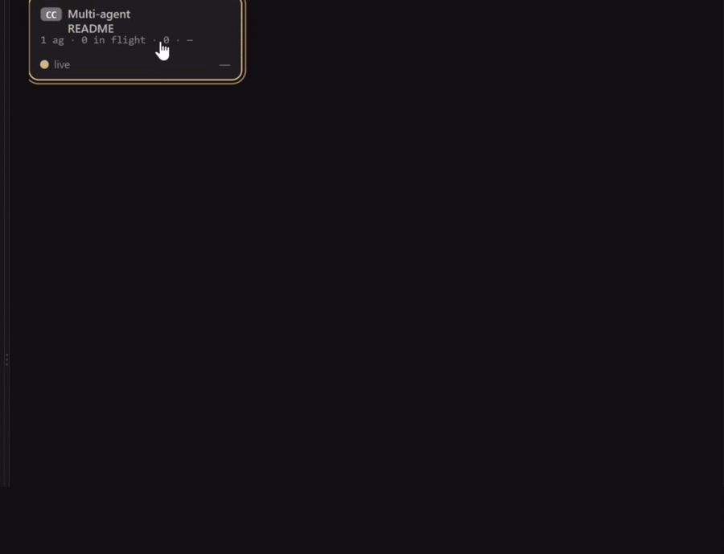
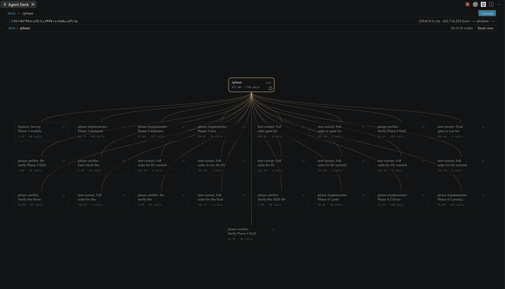

# Agent Deck

[](https://marketplace.visualstudio.com/items?itemName=nvitlam.agent-deck)

**Live observability for agent swarms, inside VS Code.** When a coding agent spawns subagents, the
terminal shows you one scrolling column and no shape. Agent Deck shows you the shape: every session
on the machine, the tree of agents inside each one, which agent spawned which, what each is running
right now, and what it has cost. It works with **Claude Code**, **OpenCode** and **Codex**, side by
side in one panel. It observes only — it never wraps, launches, proxies or configures any of them.



> **Claude Code compatibility** — anchor `2.1.246`, accepts `2.0.x` to `2.2.x`, refuses on
> structural change, not on patch number. **A session imported from another machine — Claude
> Code's `--teleport` — is not supported and renders `unsupported`.** See
> [Claude Code version window](#claude-code-version-window).

<!-- engine:opencode -->

> **OpenCode compatibility** — anchor `1.18.22`, accepts `1.17.x` to `1.19.x`, same rule: the patch
> number is not compared, and what refuses is the schema. See
> [Also observes OpenCode](#also-observes-opencode).

<!-- /engine:opencode -->

<!-- engine:codex -->

> **Codex compatibility** — anchor `0.151.0-alpha.7.2`, accepts `0.150.x` to `0.152.x`, same rule:
> neither the patch component nor the prerelease tag is compared, and what refuses is the structure.
> See [Also observes Codex](#also-observes-codex).

<!-- /engine:codex -->

---

## What you see

**The deck** — every session on the machine, one cell each, from any of the three engines. Cells
breathe while their session is working. Three layouts (List, Grid, Lanes), three sort orders (Live
first, Recent, Engine), and chips to filter by liveness or by engine. Keyboard: `A C O X`, `1 2 3`,
`L R E`.


**The tree** — one session's interior. Every agent is a node; children sit under the parent that
spawned them, in spawn order; a filament runs from each parent to every agent it spawned. A node
pulses while one of its tool calls is in flight and stops when the call ends, so the picture tells
you what is happening now, not only what happened. A parent with many children lays them out in
rows rather than one line running off the panel, and nothing is ever cut short with an ellipsis — a
long label wraps and carries its full text on hover. Anything that cannot be attached to a parent
goes to a parked rail carrying the reason, because unplaced data is shown as unplaced and never
guessed into position.



**Focus** — click any agent to re-root the tree on it and read one branch of a wide run on its own.
The breadcrumb walks back out; Reset view returns to the whole session, fitted.

**The inspector** — a drawer along the bottom, the width of the panel. Its header carries the
selected node's status, its numbers and its duration; below, every tool call in that agent is listed
with its status and the child it spawned, oldest-first or newest-first, filterable by tool. Select a
row to read its payload beside the list. **Show details** / **Hide details** collapses the payload
and **close** dismisses a row. An oldest-first list follows new calls as they arrive until you open
one or scroll away.


**Two numbers, and a third where the engine states one.** **Context** is the last message's prompt —
a level, what is in the window now, which goes up and down. **Burn** is the running total across the
session — it only goes up. **Window** sits beside them and is read from the session itself: a Codex
transcript states the model's context window, Claude Code's and OpenCode's do not, so for those two
it reads as an em dash rather than a guess. There is no percentage anywhere — two of the three
engines report no window at all, and deriving one from a model name would be a number we made up.
**Cost** is rendered where it belongs on the tree; there are no cost dashboards.

## Trust

Agent Deck observes. It never acts.

- **Read-only.** It never writes to your agents' settings, your session files, or anything under
  `~/.claude`, OpenCode's data and config directories, or Codex's data root. Installing the hooks is
  a manual paste block you control, below. Zero write capability is the trust anchor, not a default
  that could be configured away.
- **Zero network egress.** No telemetry, no analytics, no CDN. Every asset the panel renders is
  local, enforced by a strict Content-Security-Policy. The only socket it opens is an HTTP listener
  bound to `127.0.0.1`, which is how the hooks reach it, and non-loopback requests are dropped. The
  OpenCode side opens **no socket at all**, and Codex's hooks arrive on that same one listener —
  there is no second port for a second engine.
- **Reasoning and thinking content is never displayed.** It is dropped where the data is read, before
  anything reaches the panel, in all three engines — including a Codex spawn's encrypted task
  description, which is never decoded. Tool payloads are truncated with an explicit marker.
- **Secret-bearing storage is never opened.** On the OpenCode side this is enumerated by name
  rather than summarised - see [Also observes OpenCode](#also-observes-opencode); the Codex side is
  enumerated the same way, in [Also observes Codex](#also-observes-codex).

The single qualification to "read-only" — what a read of OpenCode's store touches beside it — is
measured in [`SECURITY.md`](SECURITY.md) §2.

All state lives in memory and is discarded when the window closes.

<!-- engine:opencode -->

## Also observes OpenCode

Since `v0.5.0`, OpenCode sessions appear in the same deck as Claude Code ones. Each cell carries a
glyph saying which engine wrote it - `OC` - and the engine chips filter the deck to one engine or
show them all. Nothing is configured: if OpenCode is installed, its sessions are there; if it is
not, the deck says nothing about it, because an absent data directory is not an error and not a
warning.

**Four tables are never read**, and this is by name rather than by filter: `account`,
`control_account`, `credential` and `session_share`. Those are the tables whose schema carries
access tokens, refresh tokens and share secrets. They are not queried, and they are stripped from
every test corpus in the project.

One file is read — the session database under OpenCode's data directory — and nothing else beside
it. There is no port, no `opencode serve`, and no hostname resolved.

**Compatibility, same posture as the Claude Code side.** The anchor is `1.18.22` — the release whose
captured database proved the schema. Major must match, minor may be one step either way (`1.17.x` to
`1.19.x`), and **the patch component is not compared at all**, so a self-update from `1.18.22` to a
later patch changes nothing. What refuses a session is the **schema**: if the tables and columns
actually read are not what the corpus pinned, that session renders `unsupported` rather than a
half-built tree. A database holding sessions written by several versions is normal, and the window
is applied per session, not to the file.

**One thing it does not do yet.** An OpenCode session's **burn** is present and counts the whole
prompt, cached tokens included; its **context** figure reads as an em dash, because that number is
a level rather than a total and Agent Deck does not yet read the per-step rows that carry it — so an
honest absence is shown rather than a wrong one, never a `0`.

<!-- /engine:opencode -->

<!-- engine:codex -->

## Also observes Codex

Since `v0.6.0`, Codex sessions appear in the same deck as Claude Code and OpenCode ones. Each cell
carries a glyph saying which engine wrote it - `CX` - and the engine chips, labelled **Claude Code**,
**OpenCode** and **Codex**, filter to one or show them all. Nothing is configured: if Codex has
written sessions under its data root, they are there; if it has not, the deck says nothing about it,
because an absent data root is not an error and not a warning.

**What is read is the transcripts, and nothing beside them.** They live in `$CODEX_HOME` if you set
that variable and in `~/.codex` if you do not, and it is checked each time rather than remembered.

**Five things under that root are never opened**, and this is by name rather than by filter, the
same treatment the OpenCode tables get: the credential file `auth.json`, the sandbox-secret
directory `.sandbox-secrets/`, the two machine identifiers `installation_id` and `cap_sid`, the
network-fetched `models_cache.json`, and every local database Codex keeps there. The name is judged
before any path is joined or opened, so there is no moment at which one of them has been handed to
the filesystem. [`SECURITY.md`](SECURITY.md) enumerates the list.

**No socket to Codex. No App Server, no `app-server proxy`, no second port.** Codex ships an App
Server; Agent Deck never connects to it, and that is a boundary this product keeps rather than a
feature it has not got round to. Codex hooks POST to the *same* loopback listener Claude Code's do
— one socket for the whole extension. Neither `hooks.json` nor `config.toml` is opened by this
extension either: those are Codex's own files, and yours.

**Compatibility, same posture as the other two engines.** The anchor is `0.151.0-alpha.7.2` — the
release whose captured transcripts proved the structure, taken from the corpus's own
`session_meta.payload.cli_version` and never from what a binary reports about itself. Major must
match, minor may be one step either way (`0.150.x` to `0.152.x`), and **neither the patch component
nor the prerelease tag is compared at all**. What refuses a session is the **structure**: if the
records actually read are not what the corpus pinned, that session renders `unsupported` rather
than a half-built tree. The anchor moves one way only — by harvesting a corpus from a new release —
and moving it cannot make a version work, because the parts it names are the parts nothing compares.

**One thing Codex gives that the others do not.** Its transcripts state the model's context window,
so a Codex session's **window** figure is a real number read from the session. It is stated in two
places and one of them can be empty on a turn that ended before any usage was recorded, so the
figure comes from whichever of them the session actually carries, and reads as an em dash only when
neither does.

**One thing it needs that the others do not.** Codex's hook block is a separate paste from Claude
Code's, in a different file, with a trust step of its own — see
[Install the Codex hook](#install-the-codex-hook-one-manual-paste). Without it a Codex session
still renders in full, because the tree, the tool calls and the numbers all come from the
transcript; what degrades is liveness, which falls back to file modification times.

<!-- /engine:codex -->

## Requirements

- **VS Code** `^1.134.0`
- **Node** `>=22.22.2` on your `PATH` — the hook block below is a `node -e` one-liner, so your Node
  is what runs it
- **Claude Code** on the `2.x` line, within one minor of the anchor (see below). Patch releases are
  read as they come.
- **OpenCode** — optional, and there is nothing to install or configure if you do not use it. The
  version window is in [Also observes OpenCode](#also-observes-opencode).
- **Codex** — optional in the same way, with one difference: liveness needs its own hook block
  pasted and trusted. The version window is in [Also observes Codex](#also-observes-codex) and the
  paste is in [Install the Codex hook](#install-the-codex-hook-one-manual-paste).

## Install

Install from the VS Code Marketplace - open the **Extensions** view and search for
**Agent Deck**, or run:

```console
code --install-extension nvitlam.agent-deck
```

**To open it:** run **Agent Deck: Open Session Deck** from the Command Palette. Your sessions
appear on their own — there is nothing to point it at and nothing to switch on.

**Then install the hook block below. Optional.** Without it Agent Deck still shows the tree, but it
cannot tell you what is running right now — liveness is inferred from file times and the panel says
so.

## Install the hook (one manual paste)

This block is **Claude Code's**. Codex has its own, further down; OpenCode needs none.

Content and the tree render from the session files alone. The hook is what makes liveness *live* —
which agent is running right now, which tool call is in flight.

**Agent Deck never installs this for you and never writes either settings file.** Read-only
includes your configuration: you paste it, you own it.

Paste the `"hooks"` key below into **one** of:

- your project's own `.claude/settings.local.json` — what this repository does, and the choice that
  keeps `~/.claude` untouched entirely; or
- your user-level `~/.claude/settings.json`, if you would rather have it everywhere.

Both files are JSON objects. Merge the `"hooks"` key into whatever is already there rather than
replacing the file.

```json
{
  "hooks": {
    "SessionStart": [
      {
        "hooks": [
          {
            "type": "command",
            "command": "node -e \"let b='';process.stdin.setEncoding('utf8');process.stdin.on('error',()=>process.exit(0));process.stdin.on('data',c=>b+=c);process.stdin.on('end',()=>{const r=require('http').request({host:'127.0.0.1',port:47821,path:'/event',method:'POST',headers:{'content-type':'application/json','content-length':Buffer.byteLength(b),connection:'close'}},s=>{s.resume();s.on('end',()=>process.exit(0))});r.on('error',()=>process.exit(0));r.setTimeout(1000,()=>{r.destroy();process.exit(0)});r.end(b)});setTimeout(()=>process.exit(0),2000)\"",
            "timeout": 5
          }
        ]
      }
    ],
    "PreToolUse": [
      {
        "matcher": "*",
        "hooks": [
          {
            "type": "command",
            "command": "node -e \"let b='';process.stdin.setEncoding('utf8');process.stdin.on('error',()=>process.exit(0));process.stdin.on('data',c=>b+=c);process.stdin.on('end',()=>{const r=require('http').request({host:'127.0.0.1',port:47821,path:'/event',method:'POST',headers:{'content-type':'application/json','content-length':Buffer.byteLength(b),connection:'close'}},s=>{s.resume();s.on('end',()=>process.exit(0))});r.on('error',()=>process.exit(0));r.setTimeout(1000,()=>{r.destroy();process.exit(0)});r.end(b)});setTimeout(()=>process.exit(0),2000)\"",
            "timeout": 5
          }
        ]
      }
    ],
    "PostToolUse": [
      {
        "matcher": "*",
        "hooks": [
          {
            "type": "command",
            "command": "node -e \"let b='';process.stdin.setEncoding('utf8');process.stdin.on('error',()=>process.exit(0));process.stdin.on('data',c=>b+=c);process.stdin.on('end',()=>{const r=require('http').request({host:'127.0.0.1',port:47821,path:'/event',method:'POST',headers:{'content-type':'application/json','content-length':Buffer.byteLength(b),connection:'close'}},s=>{s.resume();s.on('end',()=>process.exit(0))});r.on('error',()=>process.exit(0));r.setTimeout(1000,()=>{r.destroy();process.exit(0)});r.end(b)});setTimeout(()=>process.exit(0),2000)\"",
            "timeout": 5
          }
        ]
      }
    ],
    "SubagentStart": [
      {
        "hooks": [
          {
            "type": "command",
            "command": "node -e \"let b='';process.stdin.setEncoding('utf8');process.stdin.on('error',()=>process.exit(0));process.stdin.on('data',c=>b+=c);process.stdin.on('end',()=>{const r=require('http').request({host:'127.0.0.1',port:47821,path:'/event',method:'POST',headers:{'content-type':'application/json','content-length':Buffer.byteLength(b),connection:'close'}},s=>{s.resume();s.on('end',()=>process.exit(0))});r.on('error',()=>process.exit(0));r.setTimeout(1000,()=>{r.destroy();process.exit(0)});r.end(b)});setTimeout(()=>process.exit(0),2000)\"",
            "timeout": 5
          }
        ]
      }
    ],
    "SubagentStop": [
      {
        "hooks": [
          {
            "type": "command",
            "command": "node -e \"let b='';process.stdin.setEncoding('utf8');process.stdin.on('error',()=>process.exit(0));process.stdin.on('data',c=>b+=c);process.stdin.on('end',()=>{const r=require('http').request({host:'127.0.0.1',port:47821,path:'/event',method:'POST',headers:{'content-type':'application/json','content-length':Buffer.byteLength(b),connection:'close'}},s=>{s.resume();s.on('end',()=>process.exit(0))});r.on('error',()=>process.exit(0));r.setTimeout(1000,()=>{r.destroy();process.exit(0)});r.end(b)});setTimeout(()=>process.exit(0),2000)\"",
            "timeout": 5
          }
        ]
      }
    ],
    "Stop": [
      {
        "hooks": [
          {
            "type": "command",
            "command": "node -e \"let b='';process.stdin.setEncoding('utf8');process.stdin.on('error',()=>process.exit(0));process.stdin.on('data',c=>b+=c);process.stdin.on('end',()=>{const r=require('http').request({host:'127.0.0.1',port:47821,path:'/event',method:'POST',headers:{'content-type':'application/json','content-length':Buffer.byteLength(b),connection:'close'}},s=>{s.resume();s.on('end',()=>process.exit(0))});r.on('error',()=>process.exit(0));r.setTimeout(1000,()=>{r.destroy();process.exit(0)});r.end(b)});setTimeout(()=>process.exit(0),2000)\"",
            "timeout": 5
          }
        ]
      }
    ]
  }
}
```

Notes on that block, each of them measured rather than assumed:

- **It is `node -e`, not `curl`, and that is not a style choice.** This command runs inside your real
  Claude Code session on every tool call. Against a closed loopback port — which is what it finds
  whenever Agent Deck is not running — `node` takes `ECONNREFUSED` and exits `0` immediately, while
  `curl.exe` burns its full connect timeout and stalls your session that long every single time.
  Simplifying it to `curl` costs you roughly an order of magnitude, forever, on the common path.
  Measured in `SECURITY.md` §5.
- **The port must match `agentDeck.port`.** The block names `47821` literally, which is that
  setting's default. If you change one, change the other: Agent Deck reports a port collision as an
  error and never silently picks a different port, because the block you pasted has no way of being
  told.
- **No Claude Code restart is needed.** Hook settings are re-read per invocation — registering a new
  event and seeing it arrive without a restart was measured on `2.1.234`.
- **The POST is unconditional.** With nothing listening it is refused and nothing happens. A quiet
  listener is not evidence that hooks stopped firing.
- **Six events are registered:** `SessionStart`, `PreToolUse`, `PostToolUse`, `SubagentStart`,
  `SubagentStop`, `Stop`. Registering fewer still works — liveness degrades rather than fails, and
  falls back to transcript modification times with a banner — but the panel gets blunter.

<!-- engine:codex -->

## Install the Codex hook (one manual paste)

Codex keeps its hooks in its own file and gates them behind its own trust step, so this is a
second paste rather than a variant of the one above. Both engines POST to the **same** listener on
the **same** port: there is no second socket, and nothing else to turn on.

Paste the `"hooks"` key below into `~/.codex/hooks.json` — the user-level file, and the only place
this is offered. Repo-local hook discovery has been reported broken on some Codex releases, and a
paste that looks installed and never fires is worse than one you had to put somewhere central. **If
you set `$CODEX_HOME`, that is where the file goes instead** — the variable moves every Codex file,
this one included.

That file is a JSON object. Merge the `"hooks"` key into whatever is already there rather than
replacing the file; if it does not exist yet, create it with exactly what is below.

```json
{
  "hooks": {
    "SessionStart": [
      {
        "hooks": [
          {
            "type": "command",
            "command": "node -e \"let b='';process.stdin.setEncoding('utf8');process.stdin.on('error',()=>process.exit(0));process.stdin.on('data',c=>b+=c);process.stdin.on('end',()=>{const r=require('http').request({host:'127.0.0.1',port:47821,path:'/event',method:'POST',headers:{'content-type':'application/json','content-length':Buffer.byteLength(b),connection:'close'}},s=>{s.resume();s.on('end',()=>process.exit(0))});r.on('error',()=>process.exit(0));r.setTimeout(1000,()=>{r.destroy();process.exit(0)});r.end(b)});setTimeout(()=>process.exit(0),2000)\"",
            "commandWindows": "node -e \"let b='';process.stdin.setEncoding('utf8');process.stdin.on('error',()=>process.exit(0));process.stdin.on('data',c=>b+=c);process.stdin.on('end',()=>{const r=require('http').request({host:'127.0.0.1',port:47821,path:'/event',method:'POST',headers:{'content-type':'application/json','content-length':Buffer.byteLength(b),connection:'close'}},s=>{s.resume();s.on('end',()=>process.exit(0))});r.on('error',()=>process.exit(0));r.setTimeout(1000,()=>{r.destroy();process.exit(0)});r.end(b)});setTimeout(()=>process.exit(0),2000)\""
          }
        ]
      }
    ],
    "PreToolUse": [
      {
        "hooks": [
          {
            "type": "command",
            "command": "node -e \"let b='';process.stdin.setEncoding('utf8');process.stdin.on('error',()=>process.exit(0));process.stdin.on('data',c=>b+=c);process.stdin.on('end',()=>{const r=require('http').request({host:'127.0.0.1',port:47821,path:'/event',method:'POST',headers:{'content-type':'application/json','content-length':Buffer.byteLength(b),connection:'close'}},s=>{s.resume();s.on('end',()=>process.exit(0))});r.on('error',()=>process.exit(0));r.setTimeout(1000,()=>{r.destroy();process.exit(0)});r.end(b)});setTimeout(()=>process.exit(0),2000)\"",
            "commandWindows": "node -e \"let b='';process.stdin.setEncoding('utf8');process.stdin.on('error',()=>process.exit(0));process.stdin.on('data',c=>b+=c);process.stdin.on('end',()=>{const r=require('http').request({host:'127.0.0.1',port:47821,path:'/event',method:'POST',headers:{'content-type':'application/json','content-length':Buffer.byteLength(b),connection:'close'}},s=>{s.resume();s.on('end',()=>process.exit(0))});r.on('error',()=>process.exit(0));r.setTimeout(1000,()=>{r.destroy();process.exit(0)});r.end(b)});setTimeout(()=>process.exit(0),2000)\""
          }
        ]
      }
    ],
    "PostToolUse": [
      {
        "hooks": [
          {
            "type": "command",
            "command": "node -e \"let b='';process.stdin.setEncoding('utf8');process.stdin.on('error',()=>process.exit(0));process.stdin.on('data',c=>b+=c);process.stdin.on('end',()=>{const r=require('http').request({host:'127.0.0.1',port:47821,path:'/event',method:'POST',headers:{'content-type':'application/json','content-length':Buffer.byteLength(b),connection:'close'}},s=>{s.resume();s.on('end',()=>process.exit(0))});r.on('error',()=>process.exit(0));r.setTimeout(1000,()=>{r.destroy();process.exit(0)});r.end(b)});setTimeout(()=>process.exit(0),2000)\"",
            "commandWindows": "node -e \"let b='';process.stdin.setEncoding('utf8');process.stdin.on('error',()=>process.exit(0));process.stdin.on('data',c=>b+=c);process.stdin.on('end',()=>{const r=require('http').request({host:'127.0.0.1',port:47821,path:'/event',method:'POST',headers:{'content-type':'application/json','content-length':Buffer.byteLength(b),connection:'close'}},s=>{s.resume();s.on('end',()=>process.exit(0))});r.on('error',()=>process.exit(0));r.setTimeout(1000,()=>{r.destroy();process.exit(0)});r.end(b)});setTimeout(()=>process.exit(0),2000)\""
          }
        ]
      }
    ],
    "SubagentStart": [
      {
        "hooks": [
          {
            "type": "command",
            "command": "node -e \"let b='';process.stdin.setEncoding('utf8');process.stdin.on('error',()=>process.exit(0));process.stdin.on('data',c=>b+=c);process.stdin.on('end',()=>{const r=require('http').request({host:'127.0.0.1',port:47821,path:'/event',method:'POST',headers:{'content-type':'application/json','content-length':Buffer.byteLength(b),connection:'close'}},s=>{s.resume();s.on('end',()=>process.exit(0))});r.on('error',()=>process.exit(0));r.setTimeout(1000,()=>{r.destroy();process.exit(0)});r.end(b)});setTimeout(()=>process.exit(0),2000)\"",
            "commandWindows": "node -e \"let b='';process.stdin.setEncoding('utf8');process.stdin.on('error',()=>process.exit(0));process.stdin.on('data',c=>b+=c);process.stdin.on('end',()=>{const r=require('http').request({host:'127.0.0.1',port:47821,path:'/event',method:'POST',headers:{'content-type':'application/json','content-length':Buffer.byteLength(b),connection:'close'}},s=>{s.resume();s.on('end',()=>process.exit(0))});r.on('error',()=>process.exit(0));r.setTimeout(1000,()=>{r.destroy();process.exit(0)});r.end(b)});setTimeout(()=>process.exit(0),2000)\""
          }
        ]
      }
    ],
    "SubagentStop": [
      {
        "hooks": [
          {
            "type": "command",
            "command": "node -e \"let b='';process.stdin.setEncoding('utf8');process.stdin.on('error',()=>process.exit(0));process.stdin.on('data',c=>b+=c);process.stdin.on('end',()=>{const r=require('http').request({host:'127.0.0.1',port:47821,path:'/event',method:'POST',headers:{'content-type':'application/json','content-length':Buffer.byteLength(b),connection:'close'}},s=>{s.resume();s.on('end',()=>process.exit(0))});r.on('error',()=>process.exit(0));r.setTimeout(1000,()=>{r.destroy();process.exit(0)});r.end(b)});setTimeout(()=>process.exit(0),2000)\"",
            "commandWindows": "node -e \"let b='';process.stdin.setEncoding('utf8');process.stdin.on('error',()=>process.exit(0));process.stdin.on('data',c=>b+=c);process.stdin.on('end',()=>{const r=require('http').request({host:'127.0.0.1',port:47821,path:'/event',method:'POST',headers:{'content-type':'application/json','content-length':Buffer.byteLength(b),connection:'close'}},s=>{s.resume();s.on('end',()=>process.exit(0))});r.on('error',()=>process.exit(0));r.setTimeout(1000,()=>{r.destroy();process.exit(0)});r.end(b)});setTimeout(()=>process.exit(0),2000)\""
          }
        ]
      }
    ],
    "Stop": [
      {
        "hooks": [
          {
            "type": "command",
            "command": "node -e \"let b='';process.stdin.setEncoding('utf8');process.stdin.on('error',()=>process.exit(0));process.stdin.on('data',c=>b+=c);process.stdin.on('end',()=>{const r=require('http').request({host:'127.0.0.1',port:47821,path:'/event',method:'POST',headers:{'content-type':'application/json','content-length':Buffer.byteLength(b),connection:'close'}},s=>{s.resume();s.on('end',()=>process.exit(0))});r.on('error',()=>process.exit(0));r.setTimeout(1000,()=>{r.destroy();process.exit(0)});r.end(b)});setTimeout(()=>process.exit(0),2000)\"",
            "commandWindows": "node -e \"let b='';process.stdin.setEncoding('utf8');process.stdin.on('error',()=>process.exit(0));process.stdin.on('data',c=>b+=c);process.stdin.on('end',()=>{const r=require('http').request({host:'127.0.0.1',port:47821,path:'/event',method:'POST',headers:{'content-type':'application/json','content-length':Buffer.byteLength(b),connection:'close'}},s=>{s.resume();s.on('end',()=>process.exit(0))});r.on('error',()=>process.exit(0));r.setTimeout(1000,()=>{r.destroy();process.exit(0)});r.end(b)});setTimeout(()=>process.exit(0),2000)\""
          }
        ]
      }
    ]
  }
}
```

Then, in this order — and the order is the point, because every step after a missed one looks
exactly like "the extension does not work":

1. **Restart Codex.** It reads this file at startup, so nothing you paste arrives in a session
   that was already running. This is the opposite of Claude Code, which re-reads its own hook
   settings per invocation.
2. **Trust the hook when Codex asks.** Codex will not run a hook command it has not been told to
   trust. That prompt is Codex's own and it is the only step Agent Deck cannot do anything about,
   because Agent Deck never writes either of the files involved.
3. **Expect six of those, not one.** Six events sharing one identical command produce six
   distinct trust entries, one per event. Trusting one of them arms one event.
4. **Re-trust after any edit.** Editing `hooks.json` invalidates the trust entry for the events
   you touched, and those hooks then stop firing **silently** — no error, no warning, just a deck
   that has gone quiet. If liveness stops after you edit that file, this is why.

Notes on that block, each of them measured rather than assumed:

- **Both `command` and `commandWindows` are given**, carrying the same one-liner. This is a
  byte-for-byte copy of the block that produced this project's captured Codex hook corpus, both
  keys included; a hand-trimmed version of it is a version nothing here has evidence about.
- **It is `node -e`, not `curl`, for the reason the Claude Code block gives above.** Against a
  closed loopback port — what the hook finds whenever Agent Deck is not running — `node` takes
  `ECONNREFUSED` and exits in well under a fifth of a second, while `curl.exe` burns its full
  connect timeout on every tool call of every session. `SECURITY.md` §5 carries both engines'
  numbers.
- **The port must match `agentDeck.port`,** which is the same `47821` the Claude Code block names,
  because it is the same listener. Change the setting and you change both blocks.
- **Six events are registered:** `SessionStart`, `PreToolUse`, `PostToolUse`, `SubagentStart`,
  `SubagentStop`, `Stop`. Registering fewer still works — liveness degrades to transcript
  modification times rather than failing — and it is also six trust prompts rather than seven,
  which is why the list is exactly this long.
- **Agent Deck reads neither `hooks.json` nor `config.toml`, and writes neither.** You paste it;
  you own it. What reaches the extension is what your Codex sends to the loopback listener, and
  nothing else.

<!-- /engine:codex -->
## Claude Code version window

- **Anchor `2.1.246`** — the release the committed corpora were captured from. It is a
  **provenance** anchor rather than a support claim: it names the release whose structure was proved
  against real bytes, and it moves only when a new corpus is harvested.
- **Accepted `2.0.x` to `2.2.x`** — major exact, minor +/-1. **The patch component is not compared
  at all.** Whatever Claude Code ships next on this line is read.
- **What refuses instead is the structure** — a required field missing or wrong-typed, a subagent
  record without its join key, the subagent directory convention moving. Those are the changes that
  would make the rendered tree wrong, and they are the ones worth refusing on.
- Out-of-range, malformed and unreadable versions are still refused: the session renders
  `unsupported`, never a partial tree.
- **A session imported from another machine is not supported.** Claude Code's `--teleport` writes
  the imported history into the local transcript with a version this window does not accept, so the
  whole session renders `unsupported` — including the part of it that continued locally. Sessions
  started on this machine are unaffected.
- A session whose version changes partway through — Claude Code updating itself while you work — is
  accepted while every version in it stays in range, and refused as `versionChangedMidFile` once the
  drift leaves it.

**How the anchor moves, and why it is not a lever.** One way only: capture a session from the new
release, check the structural assertions against those bytes, commit the corpus, then move the
anchor. It is never moved to make a version work, because moving it cannot make anything work — the
patch number is not consulted. If a new release breaks the deck, the structural rules are what
changed, and those are what need looking at.

**What this costs, stated plainly.** Reading releases nobody captured means reading releases nobody
verified, so a structural change we have not seen can surface as a **wrong tree** rather than an
honest refusal. The alternative was measured, twice: a tolerance counted in patch releases expires,
and when it expired on 2026-08-24 every session for every user rendered `unsupported`. Tightening
the string does not buy correctness; it buys a blackout. The structural assertions are where the
honesty is kept, and they were not loosened alongside it.

## What it does not do

- **No writes of any kind.** Not to `~/.claude`, not to your Claude Code settings, not to session
  files, not to OpenCode's database or its config, not to Codex's `hooks.json` or `config.toml`. The
  one qualification is stated in full under [Trust](#trust) rather than buried here.
- **No launching, wrapping or proxying any of the three engines.** It observes what is already there.
- **No historical replay and no persistence.** Close the window and the state is gone.
- **No telemetry, no analytics, no network egress.**
- **No cost dashboards.** Totals are rendered where they belong on the tree, and that is all.
- **No control surface.** It cannot start, stop, steer or configure an agent, and it is not going to
  grow one by accident.
- **No settings for the OpenCode or Codex sides.** Each is on when its data directory exists and
  silent when it does not; there is nothing to turn on. Codex's hook block is the one thing you
  paste, and it is pasted into Codex, not into Agent Deck.

## Settings

| Setting | What it does |
| --- | --- |
| `agentDeck.port` | The loopback port the hook listener binds on `127.0.0.1`. Must match the port in the block you pasted. |
| `agentDeck.livenessThresholdMs` | How long a session may go quiet before it stops counting as live. Set it too low and one long tool call makes a healthy session flap. |
| `agentDeck.previewBytes` | Ceiling on tool-payload bytes kept per node for previews. Nothing is ever sent off the machine either way. |

## Development

Build and side-load from a checkout:

```console
npm ci
npm run build
npm run package
code --install-extension dist/agent-deck.vsix
```

## Licence

See [`LICENSE`](LICENSE).

## Status

Released on the VS Code Marketplace as `nvitlam.agent-deck`. Every part of all three engines — the
readers, the tree builder, the live-status engines and the panel — is covered by an automated suite
that runs against transcripts captured from real Claude Code sessions, a database captured from a
real OpenCode one, and transcripts and hook payloads captured from real Codex ones. No live data
directory of any of the three is ever read by a test.
