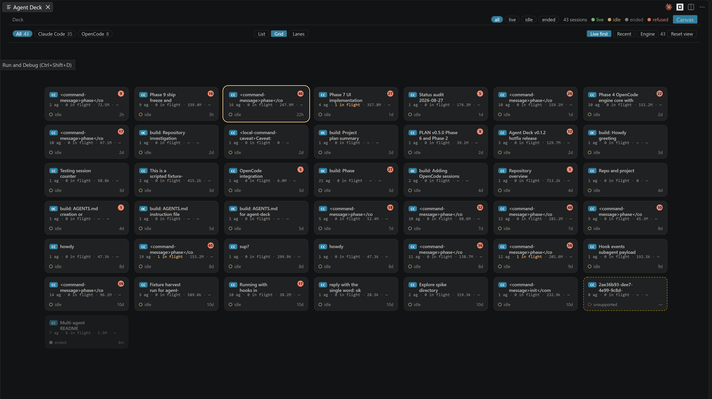
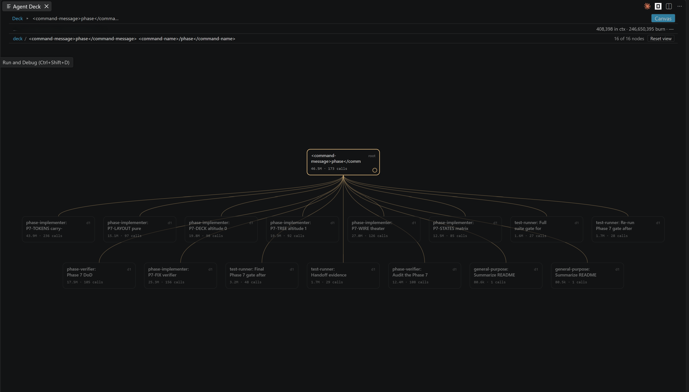
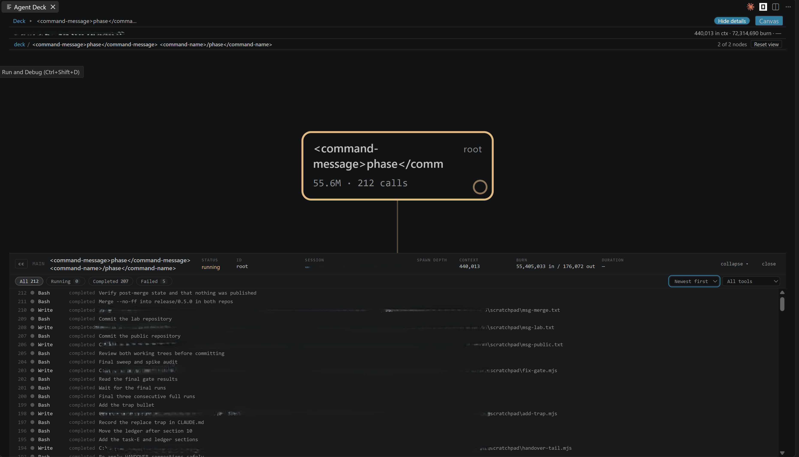
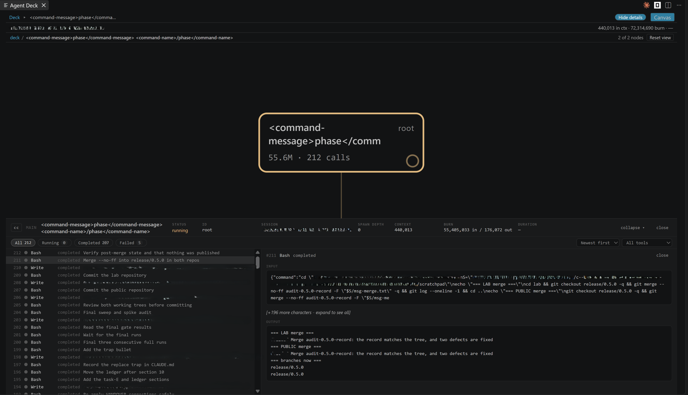

# Agent Deck

[](https://marketplace.visualstudio.com/items?itemName=nvitlam.agent-deck)

**Live observability for agent swarms, inside VS Code.** When a coding agent spawns subagents, the
terminal shows you one scrolling column and no shape. Agent Deck shows you the shape: every session
on the machine, the tree of agents inside each one, which agent spawned which, what each is running
right now, and what it has cost. It works with **Claude Code** and **OpenCode**, side by side in one
panel. It observes only — it never wraps, launches, proxies or configures either of them.

> **Claude Code compatibility** — anchor `2.1.246`, accepts `2.0.x` to `2.2.x`, refuses on
> structural change, not on patch number. **A session imported from another machine — Claude
> Code's `--teleport` — is not supported and renders `unsupported`.** See
> [Claude Code version window](#claude-code-version-window).

<!-- engine:opencode -->

> **OpenCode compatibility** — anchor `1.18.22`, accepts `1.17.x` to `1.19.x`, same rule: the patch
> number is not compared, and what refuses is the schema. See
> [Also observes OpenCode](#also-observes-opencode).

<!-- /engine:opencode -->

> This badge is text, not a remote image: a project whose selling point is zero egress should not
> make its own README phone home to a badge service to render.

---

## What you see

**The deck** — every session on the machine, one cell each, from either engine. Cells breathe while
their session is working. Three layouts (List, Grid, Lanes), three sort orders (Live first, Recent,
Engine), and chips to filter by liveness or by engine. Keyboard: `A C O`, `1 2 3`, `L R E`.



**The tree** — one session's interior. Every agent is a node; children sit under the parent that
spawned them, in spawn order; a filament runs from each parent to every agent it spawned. A node
pulses while one of its tool calls is in flight and stops when the call ends, so the picture tells
you what is happening now, not only what happened. Wide ranks wrap instead of running off the panel,
and nothing is ever cut short with an ellipsis — a long label wraps and carries its full text on
hover. Anything that cannot be attached to a parent goes to a parked rail carrying the reason,
because unplaced data is shown as unplaced and never guessed into position.



**Focus** — click any agent to re-root the tree on it and read one branch of a wide run on its own.
The breadcrumb walks back out; Reset view returns to the whole session, fitted.

**The inspector** — a drawer along the bottom, the width of the panel. Its header carries the
selected node's status, its numbers and its duration; below, every tool call in that agent is listed
with its status and the child it spawned, oldest-first or newest-first, filterable by tool. Select a
row to read its payload beside the list. **Show details** / **Hide details** collapses the payload
and **close** dismisses a row. An oldest-first list follows new calls as they arrive until you open
one or scroll away.





**Two numbers, because they answer different questions.** **Context** is the last message's prompt —
a level, what is in the window now, which goes up and down. **Burn** is the running total across the
session — it only goes up. There is no percentage, because no session states the model's window
size, and guessing one from a model name would be a number we made up. **Cost** is rendered where it
belongs on the tree; there are no cost dashboards.

## Trust

Agent Deck observes. It never acts.

- **Read-only.** It never writes to your agents' settings, your session files, or anything under
  `~/.claude` or OpenCode's data and config directories. Installing the hooks is a manual paste
  block you control, below. Zero write capability is the trust anchor, not a default that could be
  configured away.
- **Zero network egress.** No telemetry, no analytics, no CDN. Every asset the panel renders is
  local, enforced by a strict Content-Security-Policy. The only socket it opens is an HTTP listener
  bound to `127.0.0.1`, which is how the hooks reach it, and non-loopback requests are dropped. The
  OpenCode side opens **no socket at all**.
- **Reasoning and thinking content is never displayed.** It is dropped where the data is read, before
  anything reaches the panel, in both engines. Tool payloads are truncated with an explicit marker.
- **Secret-bearing storage is never opened.** On the OpenCode side this is enumerated by name
  rather than summarised - see [Also observes OpenCode](#also-observes-opencode).

The single qualification to "read-only" — what a read of OpenCode's store touches beside it — is
measured in [`SECURITY.md`](SECURITY.md) §2.

All state lives in memory and is discarded when the window closes.

<!-- engine:opencode -->

## Also observes OpenCode

Since `v0.5.0`, OpenCode sessions appear in the same deck as Claude Code ones. Each cell carries a
glyph saying which engine wrote it - `OC` or `CC` - and the engine chips, labelled **Claude Code**
and **OpenCode**, filter to one or show both. Nothing is configured: if OpenCode is
installed, its sessions are there; if it is not, the deck says nothing about it, because an absent
data directory is not an error and not a warning.

**Four tables are never read**, and this is by name rather than by filter: `account`,
`control_account`, `credential` and `session_share`. Those are the tables whose schema carries
access tokens, refresh tokens and share secrets. They are not queried, and they are stripped from
every test corpus in the project.

One file is read — the session database under OpenCode's data directory — and nothing else beside
it. There is no port, no `opencode serve`, and no hostname resolved.

**Compatibility, same posture as the Claude Code side.** The anchor is `1.18.22` — the release whose
captured database proved the schema. Major must match, minor may be one step either way (`1.17.x` to
`1.19.x`), and **the patch component is not compared at all**, so a self-update from `1.18.22` to a
later patch changes nothing. What refuses a session is the **schema**: if the tables and columns
actually read are not what the corpus pinned, that session renders `unsupported` rather than a
half-built tree. A database holding sessions written by several versions is normal, and the window
is applied per session, not to the file.

**One thing it does not do yet.** An OpenCode session's **burn** is present and counts the whole
prompt, cached tokens included; its **context** figure reads as an em dash, because that number is
a level rather than a total and Agent Deck does not yet read the per-step rows that carry it — so an
honest absence is shown rather than a wrong one, never a `0`.

<!-- /engine:opencode -->

## Requirements

- **VS Code** `^1.134.0`
- **Node** `>=20` on your `PATH` — the hook block below is a `node -e` one-liner, so your Node is
  what runs it
- **Claude Code** on the `2.x` line, within one minor of the anchor (see below). Patch releases are
  read as they come.
- **OpenCode** — optional, and there is nothing to install or configure if you do not use it. The
  version window is in [Also observes OpenCode](#also-observes-opencode).

## Install

Install from the VS Code Marketplace - open the **Extensions** view and search for
**Agent Deck**, or run:

```console
code --install-extension nvitlam.agent-deck
```

**Then install the hook block below.** It is not optional: without it Agent Deck can still read
session transcripts, but nothing tells it what is running right now, so liveness is inferred from
file mtime alone.

## Install the hook (one manual paste)

Content and the tree render from the session files alone. The hook tap is what makes liveness
*live* — which agent is running right now, which tool call is in flight.

**Agent Deck never installs this for you and never writes either settings file.** Read-only means
read-only, including your configuration. You paste it; you own it.

Paste the `"hooks"` key below into **one** of:

- your project's own `.claude/settings.local.json` — what this repository does, and the choice that
  keeps `~/.claude` untouched entirely; or
- your user-level `~/.claude/settings.json`, if you would rather have it everywhere.

Both files are JSON objects. Merge the `"hooks"` key into whatever is already there rather than
replacing the file.

```json
{
  "hooks": {
    "SessionStart": [
      {
        "hooks": [
          {
            "type": "command",
            "command": "node -e \"let b='';process.stdin.setEncoding('utf8');process.stdin.on('error',()=>process.exit(0));process.stdin.on('data',c=>b+=c);process.stdin.on('end',()=>{const r=require('http').request({host:'127.0.0.1',port:47821,path:'/event',method:'POST',headers:{'content-type':'application/json','content-length':Buffer.byteLength(b),connection:'close'}},s=>{s.resume();s.on('end',()=>process.exit(0))});r.on('error',()=>process.exit(0));r.setTimeout(1000,()=>{r.destroy();process.exit(0)});r.end(b)});setTimeout(()=>process.exit(0),2000)\"",
            "timeout": 5
          }
        ]
      }
    ],
    "PreToolUse": [
      {
        "matcher": "*",
        "hooks": [
          {
            "type": "command",
            "command": "node -e \"let b='';process.stdin.setEncoding('utf8');process.stdin.on('error',()=>process.exit(0));process.stdin.on('data',c=>b+=c);process.stdin.on('end',()=>{const r=require('http').request({host:'127.0.0.1',port:47821,path:'/event',method:'POST',headers:{'content-type':'application/json','content-length':Buffer.byteLength(b),connection:'close'}},s=>{s.resume();s.on('end',()=>process.exit(0))});r.on('error',()=>process.exit(0));r.setTimeout(1000,()=>{r.destroy();process.exit(0)});r.end(b)});setTimeout(()=>process.exit(0),2000)\"",
            "timeout": 5
          }
        ]
      }
    ],
    "PostToolUse": [
      {
        "matcher": "*",
        "hooks": [
          {
            "type": "command",
            "command": "node -e \"let b='';process.stdin.setEncoding('utf8');process.stdin.on('error',()=>process.exit(0));process.stdin.on('data',c=>b+=c);process.stdin.on('end',()=>{const r=require('http').request({host:'127.0.0.1',port:47821,path:'/event',method:'POST',headers:{'content-type':'application/json','content-length':Buffer.byteLength(b),connection:'close'}},s=>{s.resume();s.on('end',()=>process.exit(0))});r.on('error',()=>process.exit(0));r.setTimeout(1000,()=>{r.destroy();process.exit(0)});r.end(b)});setTimeout(()=>process.exit(0),2000)\"",
            "timeout": 5
          }
        ]
      }
    ],
    "SubagentStart": [
      {
        "hooks": [
          {
            "type": "command",
            "command": "node -e \"let b='';process.stdin.setEncoding('utf8');process.stdin.on('error',()=>process.exit(0));process.stdin.on('data',c=>b+=c);process.stdin.on('end',()=>{const r=require('http').request({host:'127.0.0.1',port:47821,path:'/event',method:'POST',headers:{'content-type':'application/json','content-length':Buffer.byteLength(b),connection:'close'}},s=>{s.resume();s.on('end',()=>process.exit(0))});r.on('error',()=>process.exit(0));r.setTimeout(1000,()=>{r.destroy();process.exit(0)});r.end(b)});setTimeout(()=>process.exit(0),2000)\"",
            "timeout": 5
          }
        ]
      }
    ],
    "SubagentStop": [
      {
        "hooks": [
          {
            "type": "command",
            "command": "node -e \"let b='';process.stdin.setEncoding('utf8');process.stdin.on('error',()=>process.exit(0));process.stdin.on('data',c=>b+=c);process.stdin.on('end',()=>{const r=require('http').request({host:'127.0.0.1',port:47821,path:'/event',method:'POST',headers:{'content-type':'application/json','content-length':Buffer.byteLength(b),connection:'close'}},s=>{s.resume();s.on('end',()=>process.exit(0))});r.on('error',()=>process.exit(0));r.setTimeout(1000,()=>{r.destroy();process.exit(0)});r.end(b)});setTimeout(()=>process.exit(0),2000)\"",
            "timeout": 5
          }
        ]
      }
    ],
    "Stop": [
      {
        "hooks": [
          {
            "type": "command",
            "command": "node -e \"let b='';process.stdin.setEncoding('utf8');process.stdin.on('error',()=>process.exit(0));process.stdin.on('data',c=>b+=c);process.stdin.on('end',()=>{const r=require('http').request({host:'127.0.0.1',port:47821,path:'/event',method:'POST',headers:{'content-type':'application/json','content-length':Buffer.byteLength(b),connection:'close'}},s=>{s.resume();s.on('end',()=>process.exit(0))});r.on('error',()=>process.exit(0));r.setTimeout(1000,()=>{r.destroy();process.exit(0)});r.end(b)});setTimeout(()=>process.exit(0),2000)\"",
            "timeout": 5
          }
        ]
      }
    ]
  }
}
```

Notes on that block, each of them measured rather than assumed:

- **It is `node -e`, not `curl`, and that is not a style choice.** This command runs inside your real
  Claude Code session on every tool call. Against a closed loopback port — which is what it finds
  whenever Agent Deck is not running — `node` takes `ECONNREFUSED` and exits `0` in well under a
  fifth of a second, while `curl.exe` burns its full connect timeout (measured between 1.1 s and
  2.1 s, exiting non-zero) and stalls your session that long every single time. Simplifying it to
  `curl` costs you roughly an order of magnitude, forever, on the common path. `SECURITY.md` §5
  carries the numbers.
- **The port must match `agentDeck.port`.** The block names `47821` literally, which is that
  setting's default. If you change one, change the other: Agent Deck reports a port collision as an
  error and never silently picks a different port, because the block you pasted has no way of being
  told.
- **No Claude Code restart is needed.** Hook settings are re-read per invocation — registering a new
  event and seeing it arrive without a restart was measured on `2.1.234`.
- **The POST is unconditional.** With nothing listening it is refused and nothing happens. A quiet
  listener is not evidence that hooks stopped firing.
- **Six events are registered:** `SessionStart`, `PreToolUse`, `PostToolUse`, `SubagentStart`,
  `SubagentStop`, `Stop`. Registering fewer still works — liveness degrades rather than fails, and
  falls back to transcript modification times with a banner — but the panel gets blunter.

## Claude Code version window

- **Anchor `2.1.246`** — the release the committed corpora were captured from. It is a
  **provenance** anchor rather than a support claim: it names the release whose structure was proved
  against real bytes, and it moves only when a new corpus is harvested.
- **Accepted `2.0.x` to `2.2.x`** — major exact, minor +/-1. **The patch component is not compared
  at all.** Whatever Claude Code ships next on this line is read.
- **What refuses instead is the structure** — a required field missing or wrong-typed, a subagent
  record without its join key, the subagent directory convention moving. Those are the changes that
  would make the rendered tree wrong, and they are the ones worth refusing on.
- Out-of-range, malformed and unreadable versions are still refused: the session renders
  `unsupported`, never a partial tree.
- **A session imported from another machine is not supported.** Claude Code's `--teleport` writes
  the imported history into the local transcript with a version this window does not accept, so the
  whole session renders `unsupported` — including the part of it that continued locally. Sessions
  started on this machine are unaffected.
- A session whose version changes partway through — Claude Code updating itself while you work — is
  accepted while every version in it stays in range, and refused as `versionChangedMidFile` once the
  drift leaves it.

**How the anchor moves, and why it is not a lever.** One way only: capture a session from the new
release, check the structural assertions against those bytes, commit the corpus, then move the
anchor. It is never moved to make a version work, because moving it cannot make anything work — the
patch number is not consulted. If a new release breaks the deck, the structural rules are what
changed, and those are what need looking at.

**What this costs, stated plainly.** Reading releases nobody captured means reading releases nobody
verified, so a structural change we have not seen can surface as a **wrong tree** rather than an
honest refusal. The alternative was measured, twice: a tolerance counted in patch releases expires,
and when it expired on 2026-08-24 every session for every user rendered `unsupported`. Tightening
the string does not buy correctness; it buys a blackout. The structural assertions are where the
honesty is kept, and they were not loosened alongside it.

## What it does not do

- **No writes of any kind.** Not to `~/.claude`, not to your Claude Code settings, not to session
  files, not to OpenCode's database or its config. The one qualification is stated in full under
  [Trust](#trust) rather than buried here.
- **No launching, wrapping or proxying either engine.** It observes what is already there.
- **No historical replay and no persistence.** Close the window and the state is gone.
- **No telemetry, no analytics, no network egress.**
- **No cost dashboards.** Totals are rendered where they belong on the tree, and that is all.
- **No control surface.** It cannot start, stop, steer or configure an agent, and it is not going to
  grow one by accident.
- **No settings for the OpenCode side.** It is on when OpenCode's data directory exists and silent
  when it does not; there is nothing to turn on.

## Settings

| Setting | What it does |
| --- | --- |
| `agentDeck.port` | The loopback port the hook listener binds on `127.0.0.1`. Must match the port in the block you pasted. |
| `agentDeck.livenessThresholdMs` | How long a session may go quiet before it stops counting as live. Set it too low and one long tool call makes a healthy session flap. |
| `agentDeck.previewBytes` | Ceiling on tool-payload bytes kept per node for previews. Nothing is ever sent off the machine either way. |

## Development

Build and side-load from a checkout:

```console
npm ci
npm run build
npm run package
code --install-extension dist/agent-deck.vsix
```

## Licence

See [`LICENSE`](LICENSE).

## Status

Released on the VS Code Marketplace as `nvitlam.agent-deck`. Both engines' parsers, the grafter, the
liveness engines and the renderer are covered by an automated suite that runs against transcripts
captured from real Claude Code sessions and a database captured from a real OpenCode one. Neither
the live `~/.claude` tree nor the live OpenCode database is ever read by a test.
